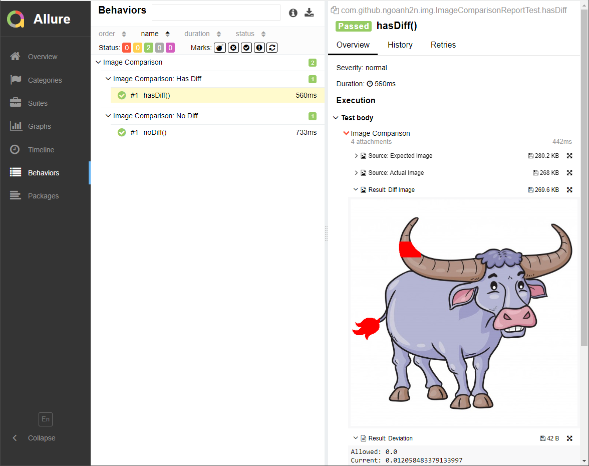

[](https://maven-badges.herokuapp.com/maven-central/com.github.ngoanh2n/image-comparator-allure)
[](https://javadoc.io/doc/com.github.ngoanh2n/image-comparator-allure)
[](http://www.oracle.com/technetwork/java/javase/downloads/index.html)
[](https://opensource.org/licenses/MIT)

# Image Comparator for Allure
<!-- TOC -->
* [Declaration](#declaration)
    * [Gradle](#gradle)
    * [Maven](#maven)
* [Description](#description)
* [System Property](#system-property)
<!-- TOC -->
When using Allure as a report framework, `image-comparator-allure` should be used.



# Declaration
### Gradle
Add to `build.gradle`.
```gradle
implementation("com.github.ngoanh2n:image-comparator-allure:1.4.0")
```

### Maven
Add to `pom.xml`.
```xml
<dependency>
    <groupId>com.github.ngoanh2n</groupId>
    <artifactId>image-comparator-allure</artifactId>
    <version>1.4.0</version>
</dependency>
```

# Description
You can change comparison description on Allure by creating file `image-comparator-allure.properties` in folder `resources`.<br>
Default description as below.
```properties
subject=Image Comparison
expImage=Source: Expected Image
actImage=Source: Actual Image
resultImage=Result: Diff Image
resultDeviation=Result: Deviation
```

# System Property
| Name                          | Description                                                                            | Default |
|:------------------------------|:---------------------------------------------------------------------------------------|:--------|
| `ngoanh2n.img.includeSource`  | Indicate which attaches image sources to Allure report.                                | `true`  |
| `ngoanh2n.img.includeResult`  | Indicate which attaches comparison result (diff image and deviation) to Allure report. | `true`  |
